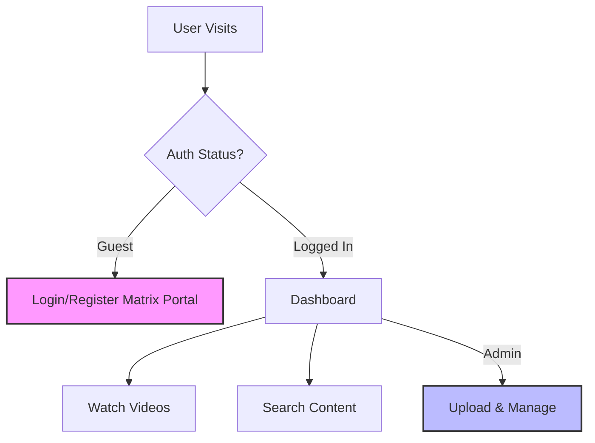

# 🚀 CodeAcademy: VideoStream Pro

> **Where coding meets the matrix.** A next-gen learning platform delivered with style.


---

## 🌟 The Vibe
Welcome to **CodeAcademy**, the video streaming platform that doesn't just work—it *flows*. We've combined the robustness of Flask with a frontend so sleek it feels like you're hacking the mainframe (in a good way). Whether you're a **Teacher** uploading the next big tutorial or a **Student** soaking up knowledge, we've got the tools you need.

### 🎨 Visual Architecture


---

## 🗓️ Project Timeline
We're moving fast. Here's how we got here and where we're going.

| Phase | Milestone | Status | ETA |
| :--- | :--- | :---: | :---: |
| **Phase 1** | **Inception & Core** <br> Basic Flask setup, Database schema, Auth system | 🚧 In Progress |
| **Phase 2** | **The Visual Overhaul** <br> Matrix theme, dark mode, responsive grid | 🚧 In Progress |
| **Phase 3** | **Content Engine** <br> Video uploads, auto-thumbnails, admin dashboard | 🚧 In Progress |
| **Phase 4** | **Social & Scale** <br> Comments, playlists, PostgreSQL migration | 🚧 In Progress |
| **Phase 5** | **Global Domination** <br> Live streaming, mobile app, AI recommendations | 🔮 Planned |

---

## ⚡ Arsenal of Features

### For Everyone
- **Matrix Mode**: A UI that makes you feel like Neo. Toggle between Light and Dark (but let's be real, Dark is better).
- **Responsive Layout**: Looks good on your 4K monitor and your potato phone.
- **Smart Search**: Find what you need before you even know you need it.

### Power User vs. Standard User
| Feature | 👩‍🎓 Student (Standard) | 👨‍💻 Teacher (Admin) |
| :--- | :---: | :---: |
| Watch Videos | ✅ | ✅ |
| Search Library | ✅ | ✅ |
| Upload Content | ❌ | ✅ |
| Delete Videos | ❌ | ✅ |
| User Management | ❌ | ✅ |
| Generate Thumbnails | ❌ | ✅ |

---

## 🛠️ Under the Hood

We built this with love, coffee, and:
- **Backend**: Python 3.8+, Flask (The microframework with macro power), SQLAlchemy.
- **Frontend**: Vanilla JS (No overhead!), CSS3 (Grid/Flexbox), HTML5.
- **Media**: MoviePy for that automatic thumbnail magic.

---

## 🚀 Launch Sequence

Ready to deploy? Follow these steps to initialize the system.

### 1. clone_the_repo
```bash
git clone <repository-url>
cd CodeAcademy
```

### 2. equip_dependencies
```bash
# Windows
python -m venv .venv
.venv\Scripts\activate
pip install -r requirements.txt
```

### 3. ignite_engine
```bash
python app.py
```
*Access the mainframe at `http://localhost:5000`*

---

## 🔐 Admin Credentials
> **⚠️ WARNING:** The system will auto-generate a Superuser on the first run. 
> Change these immediately or risk being hacked by a script kiddie.

- **Username**: `piyu`
- **Password**: `piyu`

---

## 🤝 Join the Resistance (Contributing)
Got a crazy idea? We want it.
1. Fork it.
2. Branch it (`git checkout -b feature/CoolStuff`).
3. Commit it.
4. Push it.
5. PR it.

---

## 📄 License
Distributed under the **MIT License**. Because knowledge should be free.
